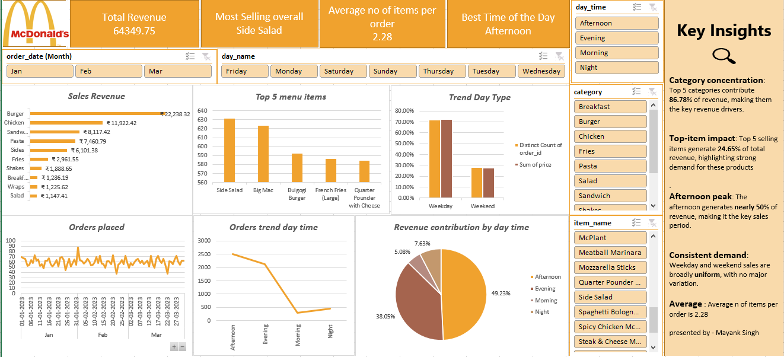

# McDonald-Case-Study
🍔 McDonald's Sales Analysis Dashboard

An interactive Excel-based sales analytics dashboard designed to analyze McDonald's menu sales, customer ordering behavior, product popularity, category performance, and time-based sales trends.

The project transforms raw sales data into actionable business insights using Excel Tables, PivotTables, PivotCharts, KPIs, slicers, and dynamic visualizations.

## Screenshot

📊 Project Overview

The objective of this project is to understand sales performance and customer purchasing patterns through an interactive dashboard.

The dashboard answers key business questions such as:

Which menu categories generate the most revenue?

How many orders are placed each day?

Which menu item is ordered most frequently?

What is the total revenue generated by menu items?

How does category revenue change across months?

What is the average number of items per order?

When are order volumes highest during the day?

How do weekday and weekend sales differ?

How does category performance vary across different months?

Which five menu items generate the highest sales?

Additional insights are included to provide a broader understanding of sales performance.

🎯 Objectives

The main objectives of the project are to:

Analyze overall sales and order performance.

Identify high-performing menu categories.

Determine the most frequently ordered menu items.

Analyze monthly and daily sales trends.

Understand customer ordering behavior by time of day.

Compare weekday and weekend performance.

Evaluate category performance across different months.

Identify the Top 5 menu items.

Calculate important sales KPIs.

Provide actionable insights through an interactive dashboard.

📌 Key KPIs

The dashboard tracks important performance indicators including:

KPI	Description
💰 Total Revenue	Total sales generated from menu items
🧾 Total Orders	Total number of customer orders
🍔 Items Sold	Total number of menu items sold
💵 Average Order Value	Average revenue generated per order
📦 Average Items per Order	Average number of items purchased per order
📈 Dashboard Analysis
1. Revenue by Menu Category

Analyzes total sales revenue generated by each menu category and identifies the categories contributing most to overall revenue.

2. Daily Order Volume

Shows the number of orders placed each day and helps identify changes in customer demand over time.

3. Most Frequently Ordered Menu Item

Ranks menu items based on ordering frequency to identify the products with the highest customer demand.

4. Total Menu Item Revenue

Analyzes revenue generated by individual menu items and provides a detailed view of product-level performance.

5. Monthly Category Revenue

Compares revenue generated by different menu categories across months to identify seasonal patterns and changes in category performance.

6. Average Items per Order

Measures the average number of menu items included in each order.

Formula:

Average Items per Order = Total Items Sold / Total Orders

7. Orders by Time of Day

Analyzes order volumes across different times of the day to identify peak ordering periods.

8. Weekday vs Weekend Performance

Compares sales and order activity between weekdays and weekends to identify differences in customer behavior.

9. Category Performance by Month

Uses a month-by-category analysis to identify categories that perform strongly or weakly during particular periods.

10. Top 5 Menu Items

Ranks the five highest-performing menu items based on sales/revenue and provides a direct comparison of their performance.

💡 Additional Insights

Beyond the core questions, the dashboard also explores:

Peak sales day

Peak ordering hour

Best-performing month

Revenue contribution by category

Low-performing menu items

Revenue concentration among the Top 5 products

Weekday vs weekend revenue mix

Category growth and monthly changes

Customer ordering patterns

These insights can support decisions related to inventory planning, staffing, promotions, menu management, and sales strategy.

🛠️ Tools & Technologies

Microsoft Excel

Excel Tables

PivotTables

PivotCharts

Slicers

Conditional Formatting

Excel formulas

Data cleaning and transformation

Interactive dashboard design

📂 Project Structure
McDonalds-Sales-Dashboard/
│
├── 📊 McDonalds_Sales_Dashboard.xlsx
├── 📄 README.md
│
├── 📁 data/
│   └── mcdonalds_sales_data.csv
│
├── 📁 screenshots/
│   └── dashboard.png
│
└── 📁 documentation/
    └── project_summary.md

File and folder names can be adjusted to match the actual repository structure.

🔄 Dashboard Workflow
Raw Sales Data
      ↓
Data Cleaning & Preparation
      ↓
Excel Table
      ↓
PivotTables & Calculations
      ↓
PivotCharts & Visualizations
      ↓
Interactive Slicers
      ↓
Sales Dashboard
      ↓
Business Insights

🎛️ Interactive Features

The dashboard is designed for easy exploration through interactive filters such as:

Date

Month

Menu Category

Menu Item

Day of Week

Weekday / Weekend

Time / Hour

Users can select different filters and dynamically explore changes in sales, orders, revenue, and product performance.

📊 Expected Business Value

The dashboard helps stakeholders:

Quickly understand overall sales performance.

Identify the products and categories driving revenue.

Detect peak ordering periods.

Understand customer purchasing patterns.

Compare weekday and weekend behavior.

Identify seasonal changes in category performance.

Monitor high- and low-performing products.

Support data-driven operational decisions.

🚀 How to Use

Download or clone this repository.

Open McDonalds_Sales_Dashboard.xlsx in Microsoft Excel.

Navigate to the Dashboard sheet.

Use the available slicers and filters to explore the data.

Review KPI cards and visualizations.

Navigate to supporting PivotTables/calculation sheets for detailed analysis.

Refresh the workbook after updating the underlying data.

📋 Business Questions

This project answers the following questions:

What is the total sales revenue for each category of menu items?

How many orders are placed each day?

Which menu item is the most frequently ordered?

What is the total revenue generated by menu items?

How does the revenue of each category compare over months?

What is the average number of items per order?

How do order volumes vary by time of day?

How do sales trends differ across weekdays and weekends?

How does sales performance vary by category over different months?

What are the sales figures for the Top 5 menu items?

📌 Key Takeaway

This project demonstrates how Excel can be used as a business intelligence and data visualization tool to transform raw restaurant sales data into an interactive analytical dashboard.

The dashboard brings together sales performance, product popularity, customer behavior, and time-based trends in one place, making it easier to explore the data and derive actionable business insights.

👤 Author

[Mayank Singh]

Data Analytics | Excel | Data Visualization | Business Intelligence

⭐ Project

If you find this project useful, feel free to star ⭐ the repository and explore the dashboard.
